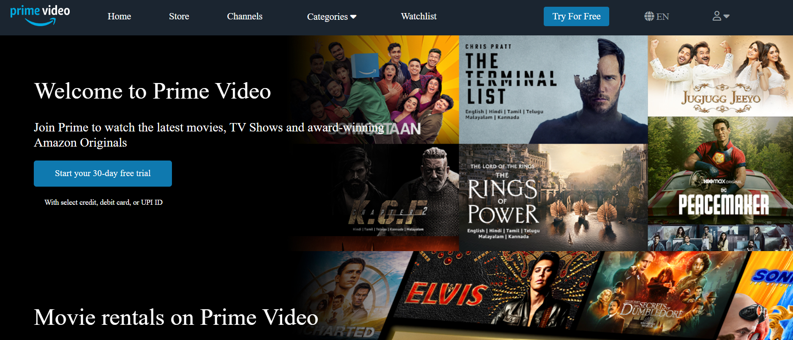

<h1 align="center">Hi 👋, I'm Md Alqma Ansari</h1>
<h3 align="center">A passionate Full Stack Developer from India</h3>

  

- 🔭 I’m currently working on **Disney + Hotstar Clone**

- 🌱 I’m currently learning **React, Redux, NodeJs, Express, MongoDB**

- 💬 Ask me about **MERN**

- 📫 How to reach me **mdalqma7@gmail.com**

- ⚡ Fun fact **I am funny**

<h3 align="left">Connect with me:</h3>

<h3 align="left">Languages and Tools:</h3>

  &nbsp;   &nbsp;  &nbsp;  &nbsp;  &nbsp;  &nbsp;  &nbsp;  &nbsp;  &nbsp;  &nbsp;  &nbsp;  &nbsp;  &nbsp;  &nbsp;  

<h2> My Projects :-</h2>
<h3>Mahabis Clone &nbsp;<a  style="text-align:center;" href="https://dreamy-frangipane-645120.netlify.app/">Live </a></h3>

<h3>Udemy Clone &nbsp;<a  style="text-align:center;" href="https://joyful-cendol-eadc85.netlify.app/">Live </a></h3>

<h3>Amazon Prime Video Clone &nbsp;<a  style="text-align:center;" href="https://amazon-prime-clone-masai-team7.netlify.app/home/home">Live </a></h3>

 
 
 

&nbsp;

